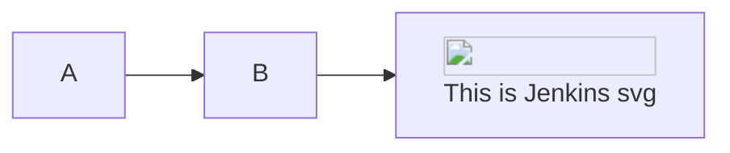

# Mermaid testing

A simple Flowchart

```mermaid
flowchart LR
A --> B --> Jenkins[<img src='https://www.jenkins.io/images/logos/jenkins/jenkins.svg' width='25' height='25' /> This is Jenkins svg]
```
