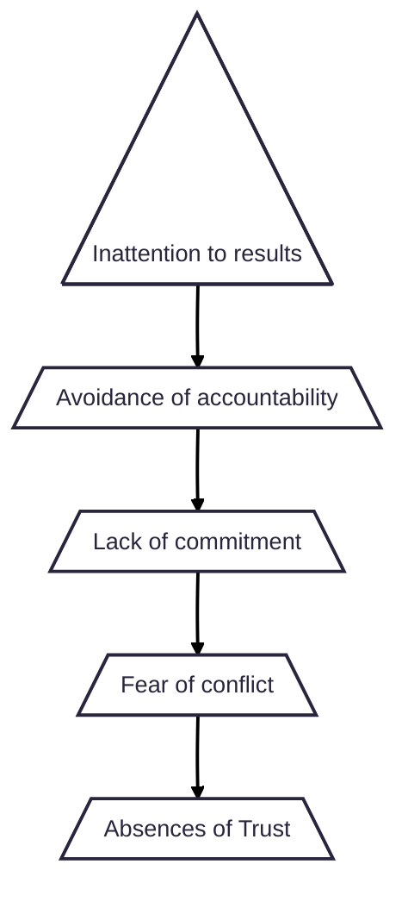

# The Five Dysfunctions of a Team

## The FIVE Dysfunctions of a Team

### Dramatis personae

* **Kathryn Peterson**: Newly appointed CEO of DecisionTech, mother and former Teacher.
* **Jeff Shanley**: Former CEO, Business Development, Hiring Executives and raising money
* **Michele Bebe (Mikey)**: Marketing Executive
* **Martin Gilmore**: Founder, CTO and British
* **Jeff Rawlins (JR)**: Sales
* **Carlos Amador**: Customer Support
* **Jan Mersino**: CFO
* **Nick Farrell**: COO

### page Notes

**p047** "So you don't agree on most things, and yet you don't seem willing to admit that you have concerns. Now, I'm no Ph.D. in psychology, but that's a trust issue if I've ever heard of one."\
**p088** Kathryn thought for just a moment and then answered as though she were reciting from a book she had memorized. "Polirics is when people shoose their words and actions based on how the want others to react rather than based on what they really think."\
**p102** " ... A movie, on average, runs anywhere from ninety minutes to two hours in length. Staff meetings are about the same. " ... "And yet meetings are interactive, whereas movies are not. ..." ... "And more importantly, movies have no real impact on our lives. They don't require us to act a certain way based on the outcome of the story. And yet meetings are both interactive and relevant. We get to have our say, and the outcome of any given discussion often has a very real impact on our lives. So why do we dread meetings?"\
**p103** "Every great movie has conflict."

## Chapter "Tha talk"

there should have been more 1-on-1 conversations with Mickey before her "resignation"

## Pyramid

